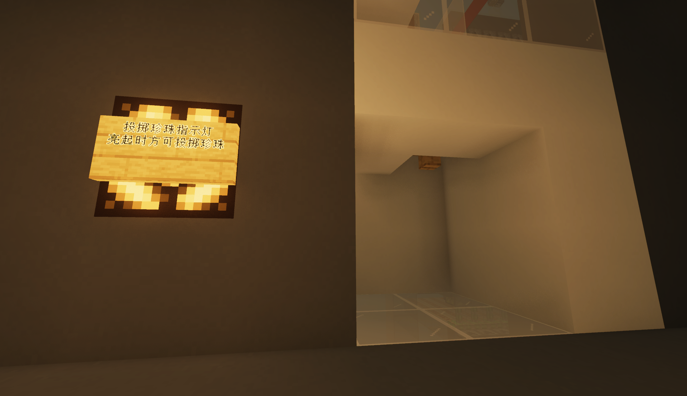

# Maintrav World 夜猫牌珍珠炮配置计算机

## 使用方法

* 输入希望前往的x及z坐标

* 点 **_计算_**

* 按照输出配置珍珠炮$^{[1][2]}$

# 珍珠炮配置教学

* 配置西/北侧TNT数量 (例: 480)

* 配置东/南侧TNT数量 (例: 40)

* 配置方向 (例: 北)

* 加载配置

* 等待指示灯亮起，并在木栏杆处向上垂直投掷珍珠$^{[3]}$

$^{[1]}$ 珍珠炮精度为10 TNT，适当时请自行四舍五入

$^{[2]}$ 如输出结果不在珍珠炮配置范围内，则此坐标不在珍珠炮打击范围内

$^{[3]}$ 珍珠矫正有小概率失败，待TNT爆炸后重新投掷即可